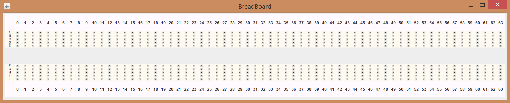

# Breadboard Simulator

## Introduction

Soldering every circuit you build probably isn’t practical. At some point, you are likely to use a temporary method to connect different components together, such as a breadboard. This simulator allows users to experiment with breadboards online, enhancing learning resources for students who may not be able to experiment outside of scheduled lab times without supervision.

## Problem Definition

The objective of this project is to develop a Java Applet that displays the image of a breadboard and allows components to be selected for the circuit. Once a circuit is defined, the user can select various inputs from a set of available inputs. The project focuses on both analog and digital circuits. It aims to prevent electrical issues like short circuits and reduces the risk of harm by simulating breadboard use online.

## Concepts of Object-Oriented Programming (OOP) Used

### Applet

Applet is a Java program that can be embedded into a web page and runs inside the web browser.

**Features of Applets:**

- Displaying dynamic web pages
- Playing sound files
- Displaying documents
- Playing animations

### Event Handling

Java's `java.awt.event` package provides many event classes and listener interfaces for event handling, including `ActionEvent`, `MouseEvent`, `KeyEvent`, and more.

### Swing in Java

Java Swing is part of Java Foundation Classes (JFC) and is used to create window-based applications. It is built on top of AWT (Abstract Window Toolkit) API and is entirely written in Java. Swing provides a richer set of GUI components than AWT.

**Difference between AWT and Swing:**

- AWT components are heavyweight; Swing components are lightweight.
- Swing is platform-independent, whereas AWT is platform-dependent.
- Swing provides more advanced features and richer functionality compared to AWT.

### Encapsulation and Data Hiding

Classes in this project encapsulate data and hide the internal representation from the outside. For example:

- `Attribute` class to store pin attributes.
- `Cordinate` class to manage pin coordinates.
- `Pins` class to describe pins with their coordinates and attributes.

### Vectors

Vectors are used throughout the program to store various types of data, making variables easily accessible and aiding in the dynamic storage of pins.

## Modules

The problem statement is divided into smaller parts to make it easier to understand and implement.

- **BreadBoard.java:** Implements the basic layout of the breadboard structure.
- **Connect.java:** Implements the window that pops up after clicking any of the pins, giving the user choices for further actions.
- **ICOption.java:** Provides the user with choices of ICs to add.
- **Gates.java:** Implements the backend logic for each IC chosen by the user.
- **PinOption.java:** Implements the connection of one pin to another based on user input.
- **Display.java:** Shows the different inputs and outputs inserted in a program.
- **Simulator.java:** Contains the main method with a JFrame containing the applet.

## Installation

You can install the JDK on a Debian-based system using the following command:

```bash
sudo apt-get install openjdk-11-jdk
```

## Program

The source code files include detailed implementations of the classes and their functionalities.

## Screenshots

Screenshots of the application in various states can be found here.

<div align="center">
  
  <p><b>Figure 1:</b> Breadboard</p>
</div>

<table align="center">
  <tr>
    <td>
      
    </td>
    <td>
      
    </td>
  </tr>
</table>
<p align="center"><b>Figure 2:</b> Pin Configuration</p>

<div align="center">
  
  <p><b>Figure 3:</b> Breadboard Connection</p>
</div>

<table align="center">
  <tr>
    <td>
      
    </td>
    <td>
      
    </td>
  </tr>
</table>
<p align="center"><b>Figure 2:</b> Truth Table Output</p>

## Conclusion

This program simulates a breadboard, preventing the possible drawbacks of using a real-life breadboard. It aids students and others in understanding their circuit connections without the need for physical components.
